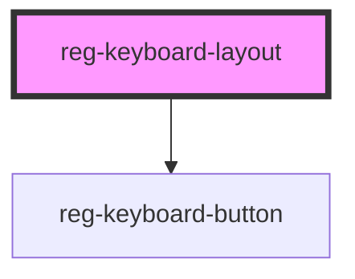

# reg-keyboard-layout

<!-- Auto Generated Below -->

## Properties

| Property                 | Attribute  | Description                                                                                         | Type                                                                                                                                                                                                                                                                | Default             |
| ------------------------ | ---------- | --------------------------------------------------------------------------------------------------- | ------------------------------------------------------------------------------------------------------------------------------------------------------------------------------------------------------------------------------------------------------------------- | ------------------- |
| `customKeys`             | --         | If you'd like to modify a certain key, you can create an object that has keys you'd like to modify. | `undefined \| { [Key: string]: Pick<KeyboardButtonProps, "addValue" \| "buttonName" \| "deleteValue" \| "pressAction" \| "text" \| "customInnerText">; }`                                                                                                           | `undefined`         |
| `customLanguageTemplate` | --         | If you'd like to use a different language than the build-in languages.                              | `KeyboardSymbol \| undefined`                                                                                                                                                                                                                                       | `undefined`         |
| `language`               | `language` | The language you'd like the keyboard to use (uses built-in language files).                         | `"arabic" \| "burmese" \| "english" \| "farsi" \| "french" \| "georgian" \| "german" \| "hebrew" \| "hindi" \| "italian" \| "japanese" \| "kannada" \| "korean" \| "russian" \| "sindhi" \| "spanish" \| "swedish" \| "thai" \| "turkish" \| "ukrainian" \| "urdu"` | `"english"`         |
| `layout`                 | `layout`   | The type of keyboard layout you'd like to render                                                    | `"condensed" \| "condensedNumpad" \| "desktop" \| "numpad"`                                                                                                                                                                                                         | `"condensedNumpad"` |

## CSS Custom Properties

| Name                              | Description                                                        |
| --------------------------------- | ------------------------------------------------------------------ |
| `--key-bg-color`                  | the background of the keys.                                        |
| `--key-bg-color-accent`           | the background of the accented keys.                               |
| `--key-box-shadow`                | the box-shadow of the keys.                                        |
| `--key-color`                     | the color of the keys.                                             |
| `--key-font-size-percent`         | font-size of the keys expressed as a percentage of the key height. |
| `--key-gap`                       | the space between the keys.                                        |
| `--keyboard-container-background` | the main background-color of the keyboard container.               |
| `--keyboard-min-height`           | the min height of the keyboard.                                    |

## Dependencies

### Depends on

- [reg-keyboard-button](../keyboard-button)

### Graph

----------------------------------------------

*Keyboard-Blocks Web Component Library* - 2020
